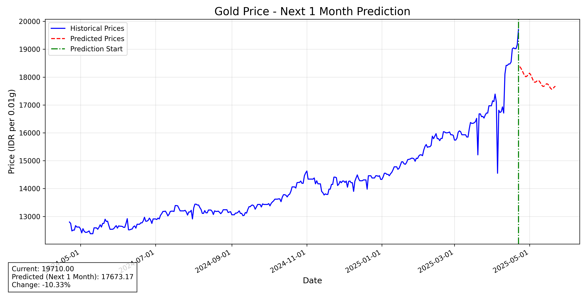
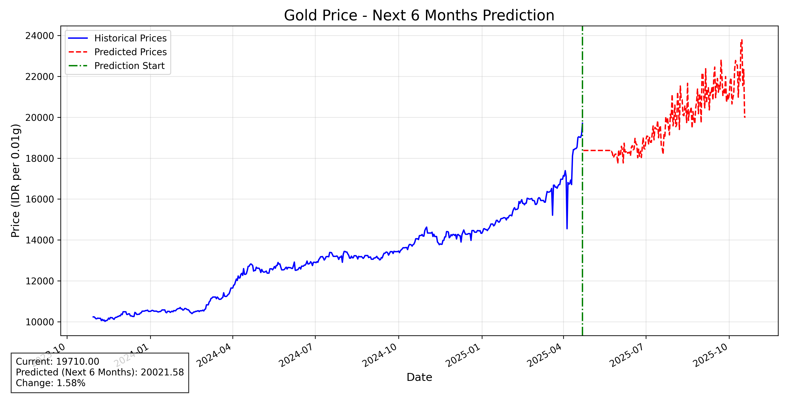
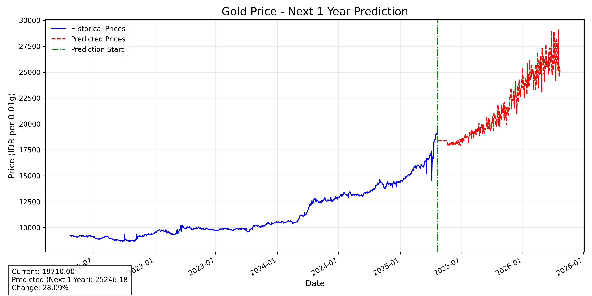
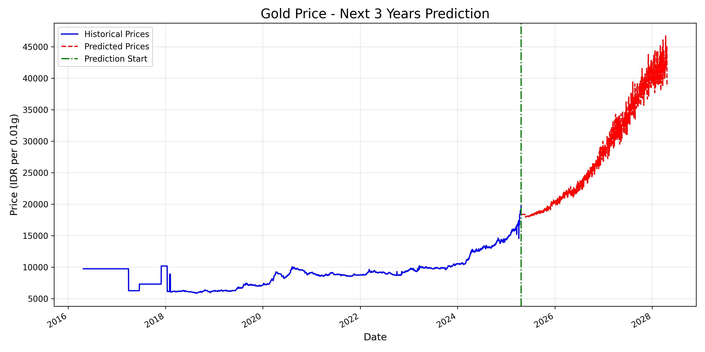
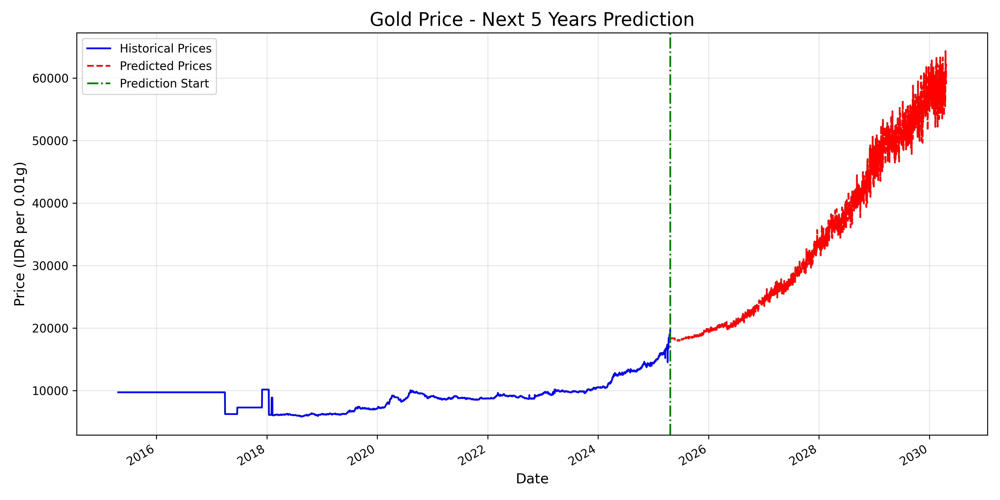

# **Indonesia Gold Price Prediction: AI-Powered Forecasting System**

## 📌 **Project Overview**

This project uses deep learning (LSTM neural networks) to predict Indonesian gold prices over multiple time horizons based on historical data. The system analyzes past price patterns to generate accurate short-term predictions and reasonable long-term forecasts up to 5 years ahead.

The model is trained on 10+ years of historical gold price data and can output predictions for:

- Next day price
- Short-term forecasts (1-6 months)
- Long-term forecasts (1-5 years)

All predictions are visualized through interactive plots and can be exported to CSV files for further analysis.

## Results

### 1 Month



### 6 Months



### 1 Year



### 3 Years



### 5 Years



## 🔍 **Technical Implementation**

### Core Components

1. **Data Processing Pipeline:**
   - Raw data loading from JSON/CSV sources
   - Preprocessing with handling of missing values and duplicates
   - Feature engineering including moving averages and volatility metrics
   - Data normalization for improved model performance

2. **Deep Learning Architecture:**
   - LSTM neural networks (Long Short-Term Memory)
   - Multiple variants including standard and enhanced models with attention mechanisms
   - Multi-layer architecture with dropout for regularization
   - Bidirectional capabilities for improved pattern recognition

3. **Training System:**
   - Configurable hyperparameters with early stopping
   - Learning rate scheduling for optimal convergence
   - Validation-based model selection
   - Loss visualization for training analysis

4. **Prediction Engine:**
   - Multiple prediction modes for different time horizons
   - Seasonal adjustment for long-term predictions
   - Support for single-day and date-range predictions
   - Comprehensive visualization capabilities

## 🛠️ **Project Structure**

```txt
├── data/                 # Data storage
│   ├── raw/              # Raw gold price data (JSON)
│   └── processed/        # Processed datasets (CSV)
├── models/               # Trained model files (.pth)
├── notebooks/            # Jupyter notebooks for exploration
├── plots/                # Generated prediction plots (.png)
├── results/              # CSV prediction results  
├── scripts/              # Data processing scripts
└── src/                  # Source code
    ├── data_loader.py    # Dataset preparation and normalization
    ├── model.py          # LSTM model architectures (standard & enhanced)
    ├── predict.py        # Prediction engine with visualization
    ├── run_prediction.py # CLI for different prediction modes
    └── train.py          # Model training system
```

## 📊 **Key Features**

### Data Processing

- **Automated cleaning:** Handles missing values, outliers, and duplicates
- **Feature engineering:** Creates temporal features like moving averages (7, 30, 365 days)
- **Volatility metrics:** Calculates price volatility over rolling windows
- **Cyclical encoding:** Transforms time-based features (day, month) using sine/cosine functions

### Model Architecture

- **Standard LSTM:** Multi-layer architecture with dropout for regularization
- **Enhanced LSTM:** Bidirectional LSTM with attention mechanism for improved pattern recognition
- **Residual connections:** For better gradient flow during training
- **Batch normalization:** For improved training stability

### Prediction Capabilities

- **Multiple time horizons:** From next-day to 5-year predictions
- **Seasonal adjustments:** Accounts for monthly and weekly patterns
- **Visualization:** Interactive plots showing historical and predicted prices
- **CSV export:** Saves predictions in structured format for analysis

## 🚀 **How to Use**

### 1. **Setup Environment**

```bash
pip install -r requirements.txt
```

Required packages include:

- torch (PyTorch)
- pandas
- numpy
- matplotlib
- seaborn

### 2. **Data Preprocessing**

```bash
python scripts/preprocess_data.py
```

This converts raw JSON data to a processed CSV with engineered features.

### 3. **Train the Model** (optional, pre-trained model included)

```bash
python src/train.py
```

### 4. **Make Predictions**

#### Next Day Prediction

```bash
python src/run_prediction.py --mode next_day
```

#### Predict Multiple Days

```bash
python src/run_prediction.py --mode days --days 30
```

#### Predict for Specific Date

```bash
python src/run_prediction.py --mode specific_date --date 2025-12-31
```

#### Predict for Date Range

```bash
python src/run_prediction.py --mode range --start_date 2025-05-01 --end_date 2025-06-30
```

#### Generate All Prediction Plots

```bash
python src/run_prediction.py --mode plot
```

#### Generate All Predictions (plots and CSV files)

```bash
python src/run_prediction.py --mode all_periods
```

### 5. **Save Predictions**

All prediction modes support saving results to CSV using the `--output` parameter:

```bash
python src/run_prediction.py --mode next_day --output results/gold_prediction.csv
```

## 📋 **Model Performance and Limitations**

### Prediction Accuracy

- **Short-term (1-30 days):** High accuracy with low prediction error
- **Medium-term (1-6 months):** Good directional accuracy with moderate price precision
- **Long-term (1-5 years):** Best used for trend analysis rather than exact price predictions

### Limitations

- Cannot account for unexpected market shocks or black swan events
- Long-term predictions incorporate inherent uncertainty
- Model requires periodic retraining as new data becomes available

## 🔍 **Data Exploration**

The project includes a Jupyter notebook (`notebooks/data_exploration.ipynb`) with detailed data analysis:

- Historical price trend visualization
- Moving average analysis
- Volatility patterns
- Seasonal patterns by month
- Feature correlation analysis

## 📝 **License**

The code in this repository is released under **CC0 1.0 Universal** — see [LICENSE](LICENSE).
That matches the other from-scratch machine learning projects in this family
(`Neural-Network-from-Scratch`, `LSTM-Gold-from-Scratch`) and places the code in
the public domain, so no attribution is required to reuse it.

> Earlier revisions of this file said MIT while the repository carried no
> LICENSE at all. Code published without a licence is all rights reserved
> whatever a README says, so nobody had permission to reuse it in the meantime.
> CC0 is strictly more permissive than the MIT that was advertised, so this
> resolves the gap without withdrawing anything anyone could have relied on.

**The bundled data is not ours to license.** `data/raw/` contains gold price
series retrieved from a third-party public endpoint. Those records belong to
their original publisher, and CC0 here covers this project's own code, notebooks
and documentation — not the underlying data. Check the source's own terms before
redistributing it.

Maintained by RoneAI (PT RoneAI Teknologi Internasional) — <hello@rone.dev>
